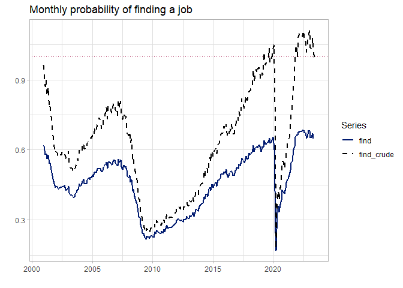

<!-- This document generates README.md upon Knitting in RStudio -->

# funDecomp

Code for the paper *Unemployment Volatility: When Workers Pay Costs upon
Accepting Jobs*. The paper is included in the top of the directory in
`unemployment_volatility_when_workers_pay_costs.pdf`.

Here’s the abstract:

> When a firm hires a worker, adding the new hire to payroll is costly.
> These costs reduce the amount of resources that can go to recruiting
> workers and affects amplify how unemployment responds to changes in
> productivity. Workers also incur up-front costs upon accepting jobs.
> Examples include moving expenses and regulatory fees. I establish that
> workers’ costs lessen the response of unemployment to productivity
> changes and do not subtract from resources available for recruitment.
> The influence of workers’ costs is bounded by properties of a matching
> function, which describes how job openings and unemployment produce
> hires. Using data on job finding that are adjusted for workers’
> transitions between employment and unemployment and for how the Job
> Openings and Labor Turnover Survey records hires, I estimate a bound
> that ascribes limited influence to workers’ costs. The results
> demonstrate that costs paid by workers upon accepting jobs affect
> outcomes in the labor market (firms threaten workers with paying the
> up-front costs again if wage negotiations fail), but their influence
> on volatility is less important than firms’ costs.

## Accessing adjusted data on job-finding and job-separation rates

Here is code that collects relevant data and plots the adjusted and
unadjusted rates of job finding.

Here’s code that

``` r
library(tidyverse) # for useful R functionality
library(here)      # for accessing the data

dat <- read_csv(here("out", "dat_02-adjust-transition-rates.csv"))

dat_useful <- dat |> 
  select(date, ends_with("_crude"), find, sep)

# Save the useful data
fout <- here("out", "dat_funDecomp.csv")
write_csv(dat_useful, file = fout)

head(dat_useful)
#> # A tibble: 6 x 5
#>   date       find_crude sep_crude  find    sep
#>   <date>          <dbl>     <dbl> <dbl>  <dbl>
#> 1 2000-12-01      0.963    0.0391 0.618 0.0402
#> 2 2001-01-01      0.950    0.0417 0.616 0.0416
#> 3 2001-02-01      0.871    0.0382 0.580 0.0394
#> 4 2001-03-01      0.900    0.0404 0.583 0.0430
#> 5 2001-04-01      0.830    0.0382 0.562 0.0389
#> 6 2001-05-01      0.869    0.0390 0.577 0.0409
```

The paper contains a detailed account of the variables. Briefly, the
variables are:

- `date` : monthly date
- `find_crude` : number of hires divided by the unemployment level
- `find` : rate of job finding adjusted to account for workers’
  transitions and hires recording all hires, even hires fired before the
  end of the month
- `sep_crude` : unadjusted separation rate
- `sep` : adjusted separation rate

Here is a figure that uses the data:

``` r
datfig <- read_csv(here("out", "dat_funDecomp.csv")) 

# Put the data into long form for plotting
datfig <- datfig |> 
  select(date, starts_with("find")) |> 
  pivot_longer(starts_with("find")) 
  
csub_blue <- rgb(0, 26, 112, maxColorValue = 255)

ggplot(data = datfig) +
  geom_hline(yintercept = 1.0, color = "maroon", linetype = "dotted") +
  geom_line(mapping = aes(x = date, y = value, color = name, linetype = name), size = 0.9) +
  scale_color_manual(values = c("find_crude" = "black", "find" = csub_blue)) +
  scale_linetype_manual(values = c("find" = "solid", "find_crude" = "dashed")) +  
  labs(x = "", y = "", title = "Monthly probability of finding a job", 
       color = "Series", linetype = "Series") +
  theme_light()  
```



Code that produces better-looking figures is contained in `cde/`.

## Overview of Code

Code that replicates that project is contained in `cde/`. The scripts
are prefixed with the order in which they need to be run.

- `01-get-FRED-data.R`: Retrieves data from
  [FRED](https://fred.stlouisfed.org/).
- `02-adjust-transition-rates.R`: Uses the FRED data to adjust rates of
  job finding and job separation to account for
  - workers’ transitions between employment and unemployment and
  - how the Job Openings and Labor Turnover Survey (JOLTS) records
    hires—all hires for a month are recorded, even those who separate
    before the month ends.
- `03-est-matching.R`: Estimates the nonlinear mathching technology,
  $M \left( u, v \right) = \mu \frac{uv}{\left( u^{\gamma} + v^{\gamma} \right)^{1/\gamma}}$.
  Various plots are produced showing how the Beveridge curve shifted
  since JOLTS data on vacancies became available and the fit produced by
  the estimated model.
- `04-plot-elasticity.R`: Plots the elasticity of matching with respect
  to unemployment, $\eta_{M,u}$, and the upper bound for $\Upsilon$,
  $\max \left( \frac{1}{\eta_{M,u}}, \frac{1}{1-\eta_{M,u}} \right)$.
  The factor $\Upsilon$ is one of the factors in [Ljungqvist and
  Sargent’s
  (2017)](https://www.aeaweb.org/articles?id=10.1257/aer.20150233)
  fundamental decomposition of the elasticity of market tightness with
  respect to productivity, $\eta_{\theta,y}$.

## Citation

Ryan, Rich. “Unemployment Volatility: When Workers Pay Costs upon
Accepting Jobs.” arXiv preprint
[arXiv:2401.07423](https://doi.org/10.48550/arXiv.2401.07423) (2024).
